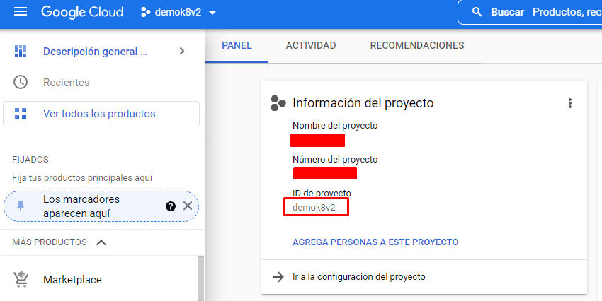

# Monitoreo-challenge

### 1. Desplegar la boutique con Kubernetes

Creamos un proyecto en google cloud platform:



Utilizamos la herramienta Cloud Shell Editor para configurar el cluster de kubernetes.

Comandos:

1. Habilitamos Google Kubernetes Engine y Cloud Operations APIs para el proyecto creado


1. Clonamos el repositorio de github


1. Creamos un cluster de Google Kubernetes Engine


1. Desplegamos la aplicacion en el cluster


1. Validamos el status de los pods creados:


1. Obtenemos la IP externa para poder conectarnos al frontend de la web


1. Ingresamos a la web en [http://35.188.147.30/](http://35.188.147.30/) y podemos ver que esta funcionando correctamente.


### 2. Instalacion de New relic en el cluster de kubernetes

Usamos el comando proveido por new relic al seleccionar “Kubernetes”, en la consola


```bash
Starting installation.
Installing New Relic CLI v0.52.3
Installing to /usr/local/bin using sudo

 _   _                 ____      _ _
| \ | | _____      __ |  _ \ ___| (_) ___
|  \| |/ _ \ \ /\ / / | |_) / _ | | |/ __|
| |\  |  __/\ V  V /  |  _ |  __| | | (__
|_| \_|\___| \_/\_/   |_| \_\___|_|_|\___|

Welcome to New Relic. Let's set up full stack observability for your environment.

✔ Connecting to New Relic Platform. 
   Connected 

Installing New Relic Kubernetes Integration
  --------------------
  Installation Summary

  ⊘  Infrastructure Agent  (unsupported)
  ⊘  Kubernetes Integration  (unsupported)

  Installation incomplete. Follow the instructions at the URL below to complete the installation process.

  ⮕  https://onenr.io/0qQapDZBPj1
```

Por algun motivo el agente de infraestructura y la integracion con kubernetes no son soportadas en Google kubernetes engine.

### Recursos:

[https://github.com/GoogleCloudPlatform/microservices-demo](https://github.com/GoogleCloudPlatform/microservices-demo)

[https://newrelic.com/platform/kubernetes/monitoring-guide](https://newrelic.com/platform/kubernetes/monitoring-guide)

[https://docs.newrelic.com/docs/kubernetes-pixie/kubernetes-integration/installation/kubernetes-integration-install-configure/](https://docs.newrelic.com/docs/kubernetes-pixie/kubernetes-integration/installation/kubernetes-integration-install-configure/)
